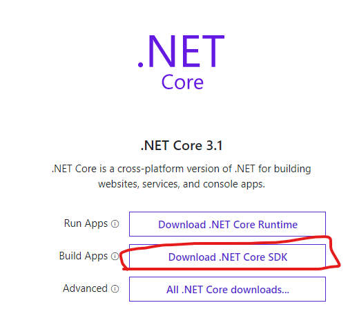
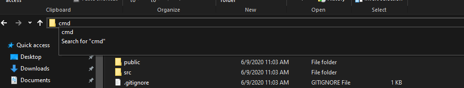
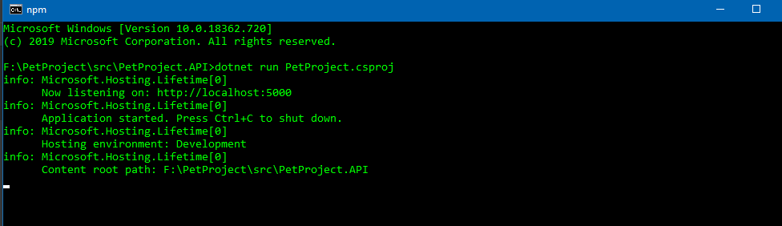
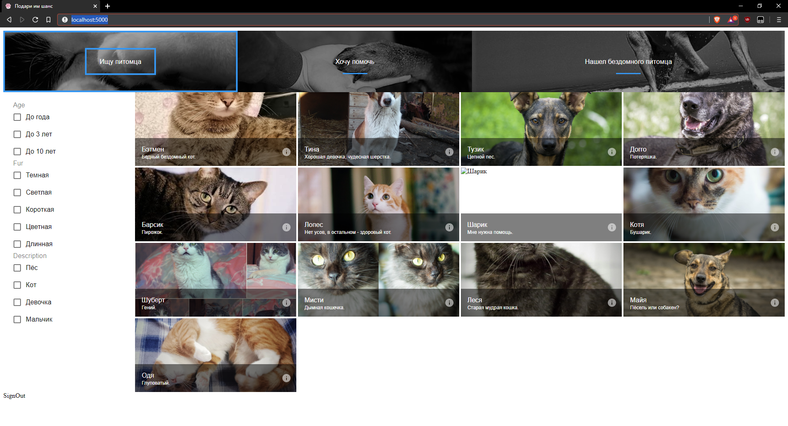

# PetProject
EPAM Homel Jam project

How to build and run application locally.
1) Clone the repository or download as a ZIP file.
2) Install Node.js https://nodejs.org/en/download/current/
3) Install .NET Core SDK https://dotnet.microsoft.com/download

4) Go to the project directory (unzip it if you've downloaded it previously).
5) Go to the src -> PetProject.API -> ClientApp
6) Open console in this directory. Example for windows:

7) Run the following command:
```bash
npm install
```
8) Go to the src -> PetProject.API and open console in this directory again.
9) Run the following command:
```bash
dotnet run PetProject.csproj
```
10) If everything went well you should see screen similar to this:

After that go to the browser and type http://localhost:5000/
And the end result:

